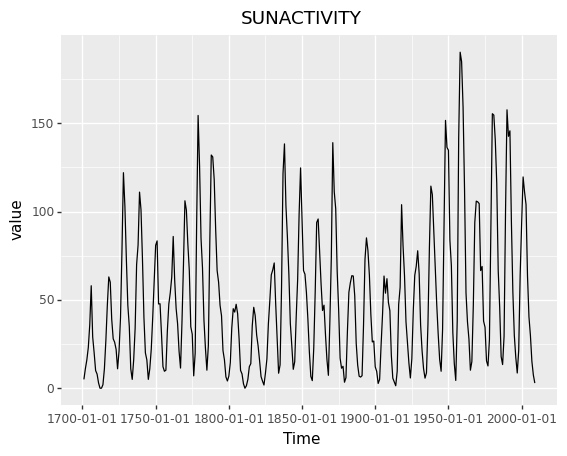

<p align="center">
    </img>
</p>

<div align="center">

[](https://github.com/enfantbenidedieu/scientisttseries/blob/master/LICENSE)
[](https://pypi.org/project/scientisttseries/)
[](https://pepy.tech/project/scientisttseries)
[](https://pepy.tech/project/scientisttseries)
[](https://pepy.tech/project/scientisttseries)

</div>


# scientisttseries : Python library for times series.

scientisttseries is a Python library for time series.

## 1 Why used scientisttseries?

scientisttseries provides functions for :

1. **Unit root test**
    * Dickey - Fuller (DF) test
    * Augmented Dickey - Fuller (ADF) test
    * Phillips - Perron (PP) test
    * Kwiatkowski, Phillips, Schmidt and Shin (KPSS) TEST

2. **Plot**
    * Times series plot (**_ggtsplot_**)
    * Autocorrelation function plot (**_ggacf_**)
    * Partial autocorrelation function (**_ggpacf_**)
    * Seasonal plot (**_ggseasonplot_**)

## 2 Installation

### 2.1 Dependencies

scientisttseries requires :

```bash
Python >=3.10
numpy >=1.26.4
matplotlib >=3.8.4
statsmodels >=0.14.0
scikit-learn >=1.2.2
pandas >=2.2.2
plotnine >=0.10.1
```

### 2.2 User installation

You can install scientisttseries using pip :

```bash
pip install scientisttseries
```

## 3 Examples

### 3.1 Plot

```python
from scientisttseries.tsaplots import ggtsplot,ggacf,ggpacf
import pandas as pd
import statsmodels.api as sm
sunspots = sm.datasets.sunspots.load_pandas().data
sunspots.index = pd.Index(sm.tsa.datetools.dates_from_range("1700", "2008"))
del sunspots["YEAR"]
p = ggtsplot(sunspots["SUNACTIVITY"])
print(p)
```

<p align="center">
    </img>
</p>


### 3.2 Autocorrelation function

```python
# Autocorrelation function
p = ggacf(sunspots["SUNACTIVITY"])
print(p)
```
<p align="center">
    </img>
</p>

### 3.3 Partial autocorrelation function

```python
# Partial autocorrelation function
p = ggpacf(sunspots["SUNACTIVITY"])
print(p)
```
<p align="center">
    </img>
</p>

### 3.4 Unit root test

#### a) ADF test

```python
# ADF test
from scientisttseries.uniroot import ADF, summaryADF
adf = ADF(sunspots["SUNACTIVITY"],typ ="none",lags=1)
summaryADF(adf)
```

#### b) PP test

```python
# PP test
from scientisttseries.uniroot import PP,summaryPP
pp = PP(sunspots["SUNACTIVITY"],typ="Z-tau",model="constant",lags="short",use_lag=None)
summaryPP(pp)
```

#### c) KPSS test

```python
# KPSS test
from scientisttseries.uniroot import KPSS,summaryKPSS
kpss = KPSS(sunspots["SUNACTIVITY"],typ="mu",lags="short",use_lag=None)
summaryKPSS(kpss)
```

## 4 Author(s)

Duvérier DJIFACK ZEBAZE ([djifacklab@gmail.com](djifacklab@gmail.com))